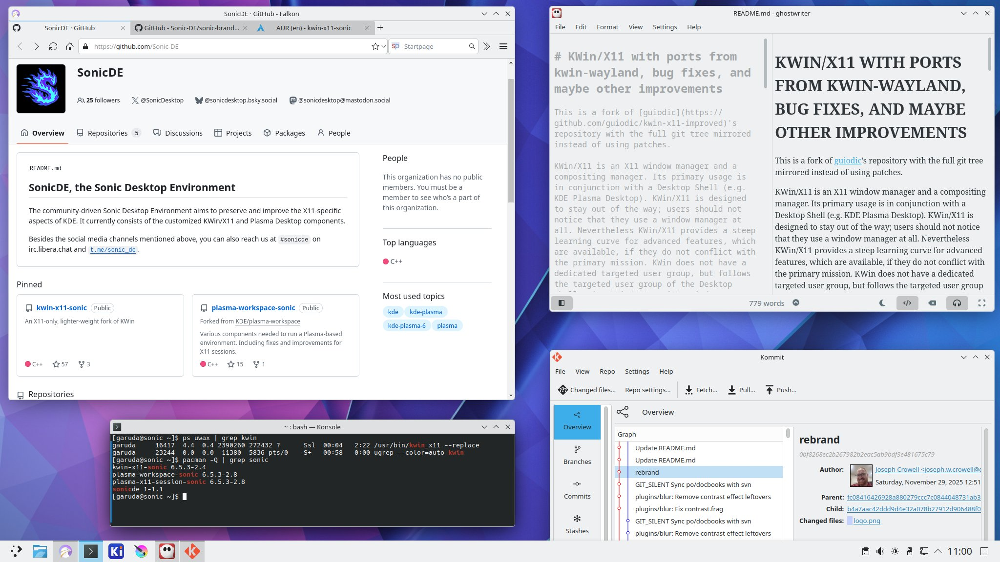

Hello,

We're SonicDE, the Sonic Desktop Environment. We aim to preserve and improve the X11-specific aspects of [KDE](https://kde.org) since they announced they are going Wayland-only in KDE Plasma 6.8. SonicDE currently consists of the customized KWin/X11 sonic-win window manager and compositor, Plasma Workspace components, the Silver theme, an SDDM theme, and some support libraries.

## History

SonicDE originates from a patch set to KWin/X11 called [kwin-x11-improved - GitHub](https://github.com/guiodic/kwin-x11-improved) created by [guiodic](https://github.com/guiodic) on Jul 7, 2025. It has been merged with the whole KWin/X11 source by [Joseph Crowell](https://github.com/josephcrowell) and named „KDE-Lite“ in September 2025 and been rebranded to [SonicDE - GitHub] in December 2025.

## Current Development and Outlook

Our current main task is forking the libraries that SonicDE depends on and removing the leftover Wayland parts everywhere to better concentrate on the X11 support. Feature-wise there is work ongoing to [implement a Vulkan Backend](https://github.com/Sonic-DE/sonic-win/issues/13). We‘d also like to make use of the expected new features of [XLibre](https://github.com/X11Libre) and remain compatible with [X.Org Server](https://gitlab.freedesktop.org/xorg/xserver) for as long as possible. Besides SonicDE on Linux, we like to support the BSDs where KDE/X11 already runs today and stay init system agnostic.

You can find the SonicDE source code at [SonicDE - GitHub](https://github.com/Sonic-DE).

## Installing SonicDE

Thanks to our contributors, there is already work ongoing to package SonicDE for different operating systems and distributions. Please see the linked pages in the table below for how to install SonicDE.

### Available Packages

| Distribution | Notes |
| - | - |
| Artix Linux | [PlasmaAndSonicDesktop - Artix Wiki](https://wiki.artixlinux.org/Site/PlasmaAndSonicDesktop) |
| All Arch Distros | [sonicde-meta - AUR](https://aur.archlinux.org/packages/sonicde-meta) |
| Debian | [sonicde-debian/debian - GitHub](https://github.com/sonicde-debian/debian) |
| Devuan | [sonicde-debian/debian - GitHub](https://github.com/sonicde-debian/debian) |
| Vendefoul Wolf | [Vendefoul Wolf - Sourceforge](https://vendefoul-wolf-linux.sourceforge.io) |

### Packaging in Progress

| Distribution | Notes |
| - | - |
| FreeBSD | [SonicDE on FreeBSD - GitHub](https://github.com/sonicde-freebsd) |
| Gentoo | [SonicDE on Gentoo - GitHub](https://github.com/sonicde-gentoo) |
| NixOS | [SonicDE on NixOS - GitHub](https://github.com/sonicde-nixos) |
| OpenMandriva | [OMA/sonic-win - GitHub](https://github.com/OpenMandrivaAssociation/sonic-win) [OMA/sonic-workspace - GitHub](https://github.com/OpenMandrivaAssociation/sonic-workspace/) |

## Getting in Contact

We'd love to hear from you on one of our channels. To get end-user support, please also check your distribution's chat or forum.

&nbsp;[Bluesky](https://bsky.app/profile/sonicdesktop.bsky.social)&nbsp; &nbsp;[Discord](https://discord.gg/cNZMQ62u5S) &nbsp; &nbsp;[Mastodon](https://mastodon.social/@sonicdesktop) &nbsp; &nbsp;[Matrix](https://matrix.to/#/#sonicdesktop:matrix.org) &nbsp; &nbsp;[OFTC IRC](https://webchat.oftc.net/?channels=sonicde%2Csonicde-devel%2Csonicde-dist&uio=MT11bmRlZmluZWQb1) &nbsp; &nbsp;[Telegram](https://t.me/sonic_de) &nbsp; &nbsp;[X (Twitter)](https://x.com/SonicDesktop)
